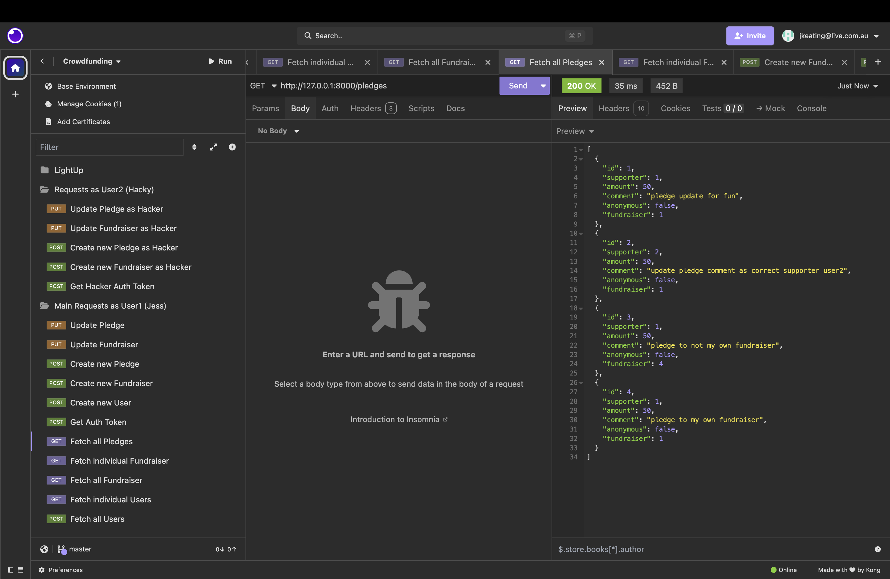

# Crowdfunding Back End
Jessica Keating

## Planning:
### Concept/Name
**LightUp** is a crowdfunding platform for community groups, schools, theatres, and event organisers to raise funds for lighting, sound, and stage production needs.  
Campaigns are focused, short-term, and tangible. Such as hiring stage lights, microphones, or projectors for a specific event.

### Intended Audience/User Stories
**Intended Audience**
- Community theatre groups needing lighting or sound hire
- School production teams seeking help for AV equipment
- Local event organisers raising funds for staging or effects
- Supporters wanting to directly contribute to creative, local events

**User Stories**
1. As a **visitor**, I want to view open fundraisers so I can discover projects to support.  
2. As a **supporter**, I want to pledge to a fundraiser so I can help make a local event happen.  
3. As a **supporter**, I want to choose to pledge anonymously so I can keep my contribution private.  
4. As a **fundraiser owner**, I want to update my fundraiser details so I can keep supporters informed.  
5. As a **fundraiser owner**, I want to close my fundraiser when the funding target is met.

### Front End Pages/Functionality
- **Home Page**
  - Featured fundraisers
  - Fundraiser search/filter
- **Create New Fundraiser Page**
  - Form with fundraiser details
  - Ability to submit
  - Nice error pages for validation
- **Fundraiser Detail Page**
  - Display full description, target, progress, and pledges
  - Pledge form for logged-in users
  - Show all pledges made so far
- **User Account Pages**
  - Sign up / Log in
  - View user’s own fundraisers and pledges

### API Spec

| URL                | HTTP Method | Purpose                        | Request Body                              | Success Code | Error Codes & Reasons                                                                   | Auth Required        |
| ------------------ | ----------- | ------------------------------ | ----------------------------------------- | ------------ | --------------------------------------------------------------------------------------- | -------------------- |
| /api-token-auth/   | POST        | Obtain authentication token    | username, password                        | 200          | 400 (invalid credentials)                                                               | No                   |
| /users/            | GET         | List all users                 | N/A                                       | 200          | None                                                                                    | No                   |
| /users/            | POST        | Register a new user            | username, email, password                 | 201          | 400 (invalid/missing fields)                                                            | No                   |
| /users/{id}/       | GET         | Retrieve user details by ID    | N/A                                       | 200          | 404 (user not found)                                                                    | No                   |
| /fundraisers/      | GET         | List all fundraisers           | N/A                                       | 200          | None                                                                                    | No                   |
| /fundraisers/      | POST        | Create a new fundraiser        | title, description, goal, image           | 201          | 400 (invalid data), 401 (not logged in)                                                 | Yes                  |
| /fundraisers/{id}/ | GET         | Retrieve fundraiser details    | N/A                                       | 200          | 404 (fundraiser not found)                                                              | No                   |
| /fundraisers/{id}/ | PUT         | Update fundraiser (owner only) | fields to update                          | 200          | 400 (invalid data), 401 (not logged in), 403 (not owner), 404 (fundraiser not found)    | Yes – owner only     |
| /pledges/          | GET         | List all pledges               | N/A                                       | 200          | None                                                                                    | No                   |
| /pledges/          | POST        | Create a pledge                | amount, comment, anonymous, fundraiser_id | 201          | 400 (invalid data), 401 (not logged in)                                                 | Yes                  |
| /pledges/{id}/     | GET         | Retrieve pledge details        | N/A                                       | 200          | 404 (pledge not found)                                                                  | No                   |
| /pledges/{id}/     | PUT         | Update pledge (supporter only) | fields to update                          | 200          | 400 (invalid data), 401 (not logged in), 403 (not pledge owner), 404 (pledge not found) | Yes – supporter only |

### DB Schema


[Heroku Deployment](https://lightup-38603a824c6f.herokuapp.com/)

### Insomnia Request Screenshots

**Successful GET**

All Users
 

All Fundraisers 
  

All Pledges
  

**Successful POST**

Create a New User
  

Create a New Fundraiser
  

Create a New Pledge
.png)  

**Returning Auth Token**

  

**Successful PUT**

Update a Fundraiser
.png) 

Update a Pledge 
  


### Instructions for Creating a New User and New Fundraiser

**Prerequisites**

Using Insomnia you can either use the deployed site link (`https://lightup-38603a824c6f.herokuapp.com/`) or your local host (`http://127.0.0.1:8000/` or `http://localhost:8000`).  

For local setup on Mac:
```bash
source venv/bin/activate   # when inside your /venv/ folder
python manage.py runserver # when in the same folder as manage.py
```


**Creating a New User in Insomnia**

1. Open Insomnia and create a new POST request.
2. Set the URL to: https://lightup-38603a824c6f.herokuapp.com/users/ 
3. In the Body tab, set type to JSON and paste: 

```json
{
	"username": "user",
	"email": "user@user.com",
	"password": "password"
}
```

4. Click Send. A successful response returns 201 Created with the new user object.


**Creating a New Fundraiser in Insomnia**

Retrieve an authentication token for the new user:
1. Create a POST request to:  https://lightup-38603a824c6f.herokuapp.com/api-token-auth/
2. In the Body tab, set type to JSON and paste:

```json
{
	"username": "user",
	"password": "password"
}
```

3. Click Send. A successful response returns 200 OK and includes a token.
4. Copy the token and use it for authentication in the next request. 

Create a new fundraiser as the user:

5. Create a new POST request to: https://lightup-38603a824c6f.herokuapp.com/fundraisers/. On this request go to the Auth tab go to the Auth tab → select Bearer Token → paste your token. 
   Or, in the Headers tab, add:
   Authorization: Token your_token_here
6. In the Body tab, set type to JSON and paste:

```json
{
	"title": "A Fundraiser Event",
	"description": "Local Event",
	"goal": 2000,
	"image": "https://via.placeholder.com/300.jpg",
	"is_open": true,
	"is_active": true
}
```

7. Click Send. A successful response returns 201 Created with the fundraiser details..
   Authorization: Token your_token_here
8. In the Body tab, set type to JSON and paste:

```json
{
	"title": "A Fundraiser Event",
	"description": "Local Event",
	"goal": 2000,
	"image": "https://via.placeholder.com/300.jpg",
	"is_open": true,
	"is_active": true
}
```

9. Click Send. A successful response returns 201 Created with the fundraiser details.